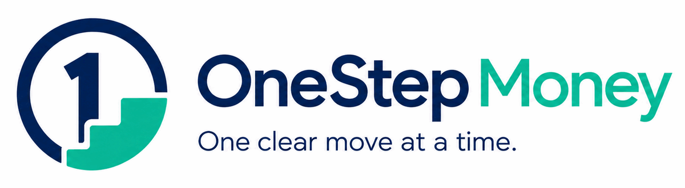

# OneStep Money



**One clear move at a time.**

OneStep Money is a local-first Windows finance companion designed to make money management less overwhelming. It keeps bank statements, payslips, debts, overdrafts, budgets and short next actions together without cloud accounts, analytics or cloud AI.

New installations start completely blank. This repository contains no personal accounts, transactions, payslips, debts, balances, tasks or financial documents.

## What it does

- Gives one small immediate action instead of a crowded to-do list.
- Imports bank statements with a review step before saving records.
- Synchronises reconciled statement balances and keeps linked overdraft usage up to date automatically.
- Imports PDF credit reports through a dated reconciliation preview that separates matches, updates, new borrowing, conflicts and accounts needing review.
- Preserves newer balances and known defaults, arrears or arrangements when a report is older, incomplete or ambiguous, while keeping current-account borrowing as overdrafts.
- Separates debts from overdrafts while applying one shared safety assessment to payoff forecasts, generated actions and local guidance.
- Protects required payments and confirmed arrangements before considering an optional debt payment.
- Tracks gross pay, PAYE, National Insurance, other deductions and net pay from supported payslips or manually entered pay records.
- Stores imported originals in an encrypted local document vault.
- Adds notes and clearer descriptions to accounts, payments, debts and overdrafts.
- Detects exact and possible duplicate transactions conservatively.
- Excludes confirmed transfers between owned accounts from income and spending.
- Uses deterministic local financial checks, with an optional small Ollama model for private natural-language guidance.
- Builds password-protected, manifest-verified portable backups containing the matching financial state and document set.
- Keeps privacy-safe local diagnostics that can be reviewed, exported or deleted from Settings.
- Supports installed Windows updates through GitHub Releases.

## Supported imports

Bank statements:

- CSV, TSV and semicolon-delimited exports, including common UK-bank headings and optional preamble rows
- QIF
- OFX and QFX
- JSON transaction arrays
- PDF layouts recognised for Nationwide, Halifax, Lloyds, Bank of Scotland and Monzo
- Conservative fallback for accessible PDFs with labelled Date, Description and Amount or Money In/Money Out columns

Payslips:

- JPA E017 PDF payslips
- MyNavy Statement of Salary and Deductions PDFs, including itemised payments, deductions, current-period balances and year-to-date totals
- Manual pay entry and full pay-record editing, with deduction totals calculated from itemised lines and reconciliation required before saving

Credit reports:

- PDF reports from Experian, ClearScore, Credit Karma, TransUnion, Equifax and TotallyMoney
- Clearly labelled provider, report date, score, lender, balance, limit, payment, APR, status and account-date fields are extracted when present
- Positive unmatched balances are added automatically after the import review; matched debts are updated and zero-balance untracked accounts are not created

Unrecognised layouts are rejected visibly. Invalid dates and amounts are never silently replaced with zero or today's date, and PDF imports that do not reconcile are marked for review.

## Financial-safety model

- Debt status and payment-arrangement status can remain explicitly unknown; missing information is never converted into a positive safety assertion.
- Defaulted debts and accounts in arrears are excluded from discretionary overpayments unless later, separate logic can establish that a different action is safe.
- Confirmed arrangement payments are treated as required commitments and are not automatically increased.
- Accounts above a known credit or overdraft limit receive priority over ordinary eligible debts, while essential commitments and cash availability remain protected.
- Conflicting tracked and imported statuses use the more cautious state and create an information-checking action.
- The optional-payment amount is capped by dependable income after budgets, unbudgeted required debt payments, scheduled commitments and the selected starter buffer. A known current-account balance can reduce that cap further so OneStep does not recommend borrowing the payment back.

## Privacy model

- Live data is stored in Electron's per-user application-data directory, outside the installed application.
- The finance state and vault key use Electron secure storage when the operating system provides it.
- Original documents are encrypted using AES-256-GCM and opened only through a restricted in-app viewer.
- Imported files are deduplicated by SHA-256 checksum.
- No cloud sync, telemetry, analytics or cloud LLM is included.
- Diagnostic events stay local, exclude financial and document content, use operating-system encryption for detailed entries, expire after 14 days and are never uploaded automatically.
- The optional guide connects only to Ollama on `127.0.0.1` and receives a compact financial summary, never raw document contents or transaction descriptions.
- Repository checks reject seeded financial data, common secret formats and financial-document file types.

## Backup and restore safety

- Backup snapshots hold the persistence lock while the financial state and encrypted document vault are copied and verified.
- Published backup manifests contain only format information, identifiers, timestamps, file sizes and SHA-256 checksums; financial values and document contents remain inside the encrypted payload.
- Restores validate the complete backup before changing live data, create a verified pre-restore safety snapshot, and install state and documents through a durable restore journal.
- If installation or post-restore verification fails, OneStep automatically restores and reopens the complete pre-restore dataset.
- An interrupted restore is resolved before normal startup. OneStep either finalises the verified restored set, rolls back to the verified original set or enters write-blocked recovery mode.
- Portable backup sources are treated as read-only. Staging data remains encrypted on disk, and legacy state-only backups are labelled as incomplete rather than presented as full restores.

## Run from source

Install a current Node.js release supported by Electron, then run:

```sh
npm ci
npm test
npm run check
npm start
```

For a local browser-safe interface preview:

```sh
npm run preview
```

The preview never exposes live finance data or the document vault.

## Build Windows installer

```sh
npm run dist:win
```

The NSIS installer is written to `dist/`. Application updates do not delete the user's application-data directory.

## Moving from an earlier personal build

Create a password-protected backup in the earlier app, install OneStep Money, then restore that backup from **Settings**. OneStep Money accepts both current `.osmb` backups and the earlier `.hfb` backup format. The migration happens on the user's device; no private data is placed in this repository or in a release package.

## Document naming

Imported documents use:

```text
YYYY-MM-DD__document-type__provider.ext
```

The original filename remains in encrypted document metadata. Numeric suffixes are added only when a canonical filename already exists.

## Local guide

The rule-based financial checks work without extra software. To use the optional local language model:

1. Install and run Ollama.
2. Install the model configured in Settings; the default is `qwen2.5:1.5b`.
3. Open **Guide** and check the local-model status.

The guide is designed to present at most one immediate action, followed by optional **This week** and **This month** steps.

## Contributing

Read [CONTRIBUTING.md](CONTRIBUTING.md) before submitting changes. Security issues should follow [SECURITY.md](SECURITY.md).

OneStep Money is a planning tool, not regulated financial advice. For debt solutions or creditor negotiations, consider free, independent UK debt advice before making an irreversible decision.

Licensed under the [MIT License](LICENSE).
